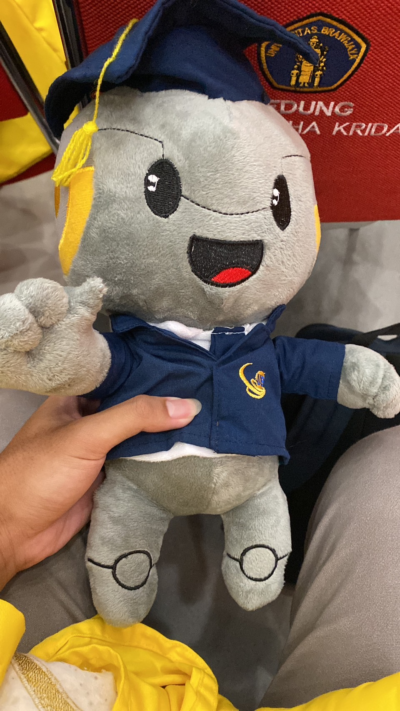
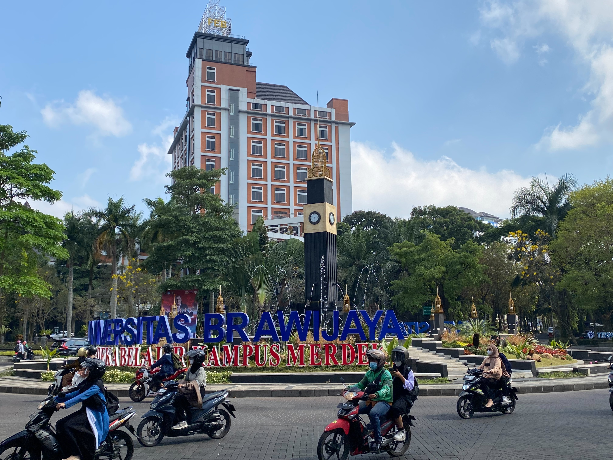
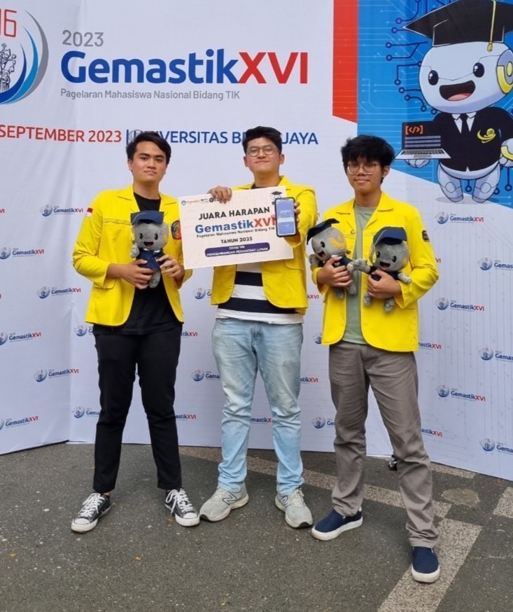
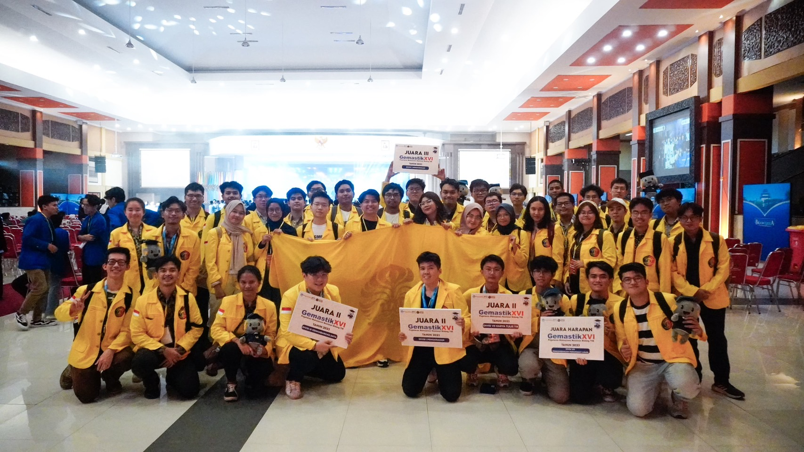

Since June and up to early September 2023, I've been working on a project for a competition. A nationwide IT and Communications competition held by the Ministry of Education and Culture between the best of the best teams from various universities in Indonesia known as [GEMASTIK](https://gemastik.kemdikbud.go.id/). My team (NextGen) and I participated in the Software Development division. We managed to take 4th place and received an Honorable Mention. While I am happy with our results, I would like to take the time to write about the events leading up to this and reflect on what I've gone through for the past few months of this year that has changed my life in more ways than one.

<!--truncate-->

 

_This plushie is essential to the plot_

## A mundane semester and summer

To be frank, from my last post up until last month I've not done much. I was looking for internship opportunites in hopes of beaing able to learn and take more responsibility for my work. I applied to around 20-30 companies and only 2 of those have offered me an interview. Of these two, none have made it into a job offer. So for several months I've only been looking for work while just doing my assignments. I've also started joining competitions because I feel a bit left out. My friends are smart, talented, and ambitious individuals. They participate in competitions and some have won multiple awards. Similar to my internship search, none of my efforts produced significant results. While I did learn a lot from my failures and shortcomings, I can't help but feel like I'm failing and not doing too well compared to my peers.

I've always been moving and doing something productive and fruitful to fill my time. This is the first time I've not produced anything with my time for a pretty long period of time. I feel that if I don't do something, I'll be left behind and stagnate. I can't help but feel that I've been wasting my time doing nothing.

That is until I received an invite to participate in GEMASTIK from my teammates.

## The birth of NextGen

My teammates, Jeremy and Angga, are friends. I know them and they know me but we weren't exactly friends at first. Friends of friends if you will. All of us are fairly active outside of academics such as participating and leading committees, organizations, doing internships, projects, etc. Simply being active got us inside each others' radars. Interestingly, they asked me to join their team. They said they were missing someone who specializes in backend engineering which is what I'm good at.

Maybe it's because I've been so tired of not doing anything meaningful for half a year but I definitely felt that I shouldn't waste this chance. Without thinking through it much, I decided to accept their invite. And so, NextGen was born.

## Pushing through the elimination round

GEMASTIK has 11 divisions as of this post. We participated in the 8th division which is Software Development. Each division goes through two stages: elimination round and finals. The elimination round is ruthless. Of the hundreds and perhaps thousands of teams across universities in Indonesia, only 20 of them will have the chance to perform in the finals. In order to make it through the elimination round, we really need to plan this right.

### Finding the right idea

We started by brainstorming for ideas. This wasn't necessarily difficult because we thankfully already had a list of ideas individually and just needed to go through them one by one and seeing if its feasible and impactful enough. After a while, we finally decided on one: a progressive literacy development platform using curated sources online. We decided to capitalize on the abundance of online reading materials (e.g. news, blogs, etc.) and adapted them into different levels of comprehension so people can read from a level their comfortable with and progressively up the level. While we added a few extra features that supplements this one, the core idea remains the same. We knew that literacy was a big problem in Indonesia, but we don't know how big and what could be the causes. To understand if we're truly solving a problem that's worthwhile, we decided to validate the problem first before anything else.

### Validating the problem

Before we actually started building, we validated our problem in two ways:

1. Conducting user interviews and surveys (Primary)
2. Journals, papers, and online publications on the topic (Secondary)

Our primary research has yielded positive results. We've confirmed the existence of a real and urgent problem in literacy, even in adults and those who pursue higher education. Our secondary research also supports this fact. Besides finding data and statistics about the existence of a problem, we also discovered the underlying issues that caused it. We also took our time to fully understand how people learn and understand how that can apply in reading literature and made adjustments in our solution to fit this model. Once we've fully confident we validated the problem, we move on to validate our solution

### Validating the solution

This stage can vary from product-to-product but our idea was to just try it out directly on users and see their feedback. We tested it out on our friends and underclassmen who were still in high school or just graduating. I also asked my teacher's opinion on it. Luckily, we got positive results and they are eager enough to see how our product can improve the quality of literacy in Indonesia. Now that we've validated the full idea, we started building the [MVP](https://distantjob.com/blog/mvp-development/).

### Building the MVP (50%) and elimination round submission

Since our team is very small and we have a pretty good understanding of the product, we decided to just document things that relates to the product and data. We created a very simple and rough [PRD](https://www.productplan.com/glossary/product-requirements-document/). Once we understood the scopes, limitations, and functionality, we divided the tasks accordingly. My other teammates focused on the Frontend and I focused on the Backend. We used a backlog management tool to help keep track of our tasks. Their approach was to first start with a medium fidelity design and then the frontend implementation. I started by modelling the system's data and process flows. For the most part, I just used a word document since it's fast to write and simple to understand. Once I've gotten a grasped of the flows and data models, I start implementing that into an API.

Each time I've done an endpoint, I notified my team so they can integrate it incrementally. That way, we don't have to wait for an entire module to finish first. We decided to be more flexible and agile in our approach as we have decent experience in building software and team collaboration already.

The target for this stage was 50% completion and thankfully we achieved that with no major issues. The next step is quite boring but unfortunately necessary which was to prepare the documents. Proposals, technical documents, license, video demos, etc. Once all of the documents are done, we submitted the files.

## And now we wait

I'll admit we were quite tired up to this point and there's about 3 weeks of waiting ahead of us so we decided to take a little breather. I hoped to push through and get the chance to compete in the finals but I wasn't really sure if we'll make it. So, instead of thinking too much about it I decided to do other things in the meantime and focus on college.

3 weeks went by and it was time to see the results. As stated before, I didn't expect for our team to pull through. As a result, I was pleasantly surprised when we saw NextGen on the list of teams who made it into the finals. I was happy and feeling more motivated than ever and celebrated a bit with my teammates. Once we've calmed down a bit, we moved on to prepare for the finals.

## Pushing through the finals

The finals was a bit different compared to the previous stage. We only have two metrics of scoring for this stage:

1. Presentation (50%)
2. QnA Challenge from the judges (50%)

Admittedly, I've never had to pitch my products to people. I have been learning about pitching to investors and how to present but this is the first time I've ever had to use said skills. I was nervous but also excited at the opportunity.

Because of certain circumstances, our time to prepare was cut short. We have less than 2 weeks of prep time. The deliverables are also a bit of a pain. If I counted correctly we needed to prepare:

1. Profile Video of the Product
2. Final Report
3. Similarity Check of the Final Report
4. Scientific Paper of the Product
5. Similarity Check of the Scientific Paper
6. Intellectual Property Rights Application
7. Presentation File
8. Video Demo
9. Consent to Publish the Scientific Paper
10. Integrity Pact
11. Re-registration

All this while needing to build the MVP up to 100%. Outside of the MVP we decided to split up the work. Final report and scientific paper are pretty similar to the previous deliverables in the elimination round so my teammates handled that and the similarity checks. All that's left is the profile video, demo video, and presentation. I decided to take care of the presentation as I trust myself more here compared to the other deliverables. I entrusted the video editing to my teammates.

### Creating the pitch deck

I've learnt a thing or two about making presentations from watching pitches and past competitions. I'm not too good at making a deck that's aesthetically pleasing so I went for something that I'm pretty good at which is simple and straightforward storytelling. I used whitespaces to my advantage and played a bit with the size and colors of the elements to attract attention in the right places. Less is more in this case worked wonders. I won't dive too deep into the deck itself but overall for less than 2 weeks of work mixed in with building the MVP, I'm satisfied with the results.

### Building the MVP (100%)

We weren't done yet with the MVP. There are still 3 features left each with their own set of functionalities. I don't know how we did it but we pulled it off. Although it did took a bit of workarounds and change in narrative to make it work but we managed to pull it off.

**Almost**.

### Trip to Malang and the product pitch

After we submitted the remaining deliverables, all that's left is to practice our presentation and prepare for whatever's necessary. The finals are held in Malang. We took a train to arrive there and stayed at a hotel near the location of the competition which was Universitas Brawijaya. The first day was mostly just team registrations and getting comfortable with Malang. We decided to walk around the campus a bit and enjoy the scenery.

_I like the atmosphere here. It calms me down_

Truth be told, we still weren't finished 100% with the MVP. But we had to make it work by readjusting our feature set and scope of the solution. And so, after our little excursion at the campus, we went back to work at the hotel. We also had to practice the presentation so we had to find balance between the two.

On the second day, the leaders of each team were gathered for a technical meeting. After the technical meeting, we had an opening ceremony until lunch. After this point, the finals finally started. It was time to present our work that we've built for the past couple of months.

I won't be diving too deep into this but it was basically like a pitch to an investor. We need to show that we found a real and urgent problem and show that our solution is innovative and actually solves the problem. The next part of the presentation was QnA. Fortunately, we could answer the questions pretty well.

With the presentation done, our work is finished. It feels like all the pressure and tension that's been building up for almost 3 months is finally gone. All that's left now is to wait. The announcement itself wasn't until the day after tomorrow. I took this chance to enjoy Malang and start working on my assignments that are put on hold to make my future's self burden a bit easier.

## The moment of truth

The announcement was going to be held at the same building as the opening ceremony. It was quite nerve wracking. I had held my composure for the past few days and even during the presentation. But nearing the actual announcement, I started to feel very nervous and anxious. How could I not? We've been preparing for this moment for nearly 3 months.

> _"What if we didn't win? What if your efforts resulted in failure? What if the past 3 months were **all for nothing**?"_

This was what I thought at the time. To ease my own mind, all I could do was pray and hope that our efforts were enough to bring back something. Fortunately, my prayers were answered.

 
_We did it!_

While we didn't enter the top 3, being able to say that we're the 4th best in the entire country feels insane to me. This is my first time at a national-level competition so being able to get an Honorable Mention was great. I couldn't be more grateful for our results than I already am. In the span of three months, I've learned so much and did things I never thought I would be able to do. Amongst this mundane and pitiful year for me, I am happy to have accomplished this. And I certainly couldn't have achieved it by myself. I owe it to my teammates and everyone who has supported me that we managed to make it this far.

## But what about your product?

The point of this post is about my journey and experience while participating for GEMASTIK. I plan on creating a separate section for all of my products and projects. I will be writing more in-depth about the product once I've finished the section.

For now, I'm going to relax and just enjoy my college life for a bit.

_Until next time!_

