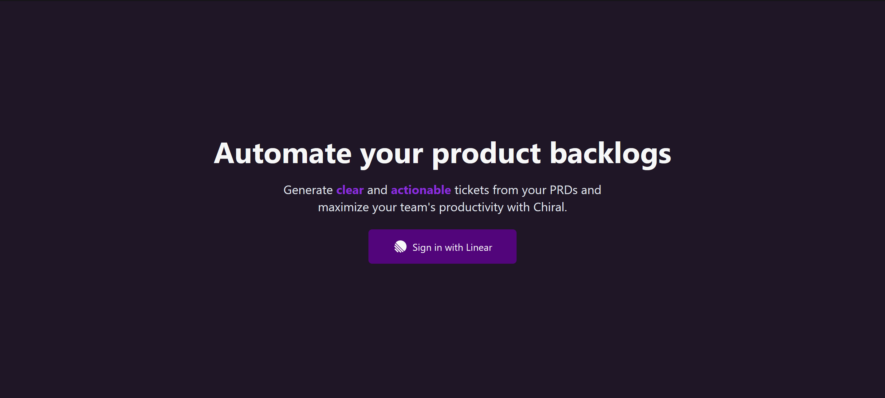
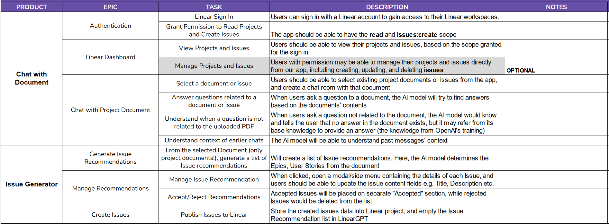

After our [achievement at GEMASTIK](/journey-to-gemastik-xvi), we decided to capitalize on the momentum and compete in another competition. Our eyes are set on a global-scale hackathon organized by [Docker on Devpost](https://docker.devpost.com). This competition lasted a month from October to November 2023. The theme revolves around using AI to solve problems related to developer experience and productivity. After going through the process of finding and validating ideas, we decided to build a product assistant to help product and engineering go through the requirement gathering, scoping, understanding, and task delegation process. We went on to winning an honorable mention with this product. How did we do it?

<!--truncate-->

_The landing page for our product, Chiral_

## Before we start...

As you can see from the title, this topic will be split into several posts. I plan to make 2 parts as cramming them into one article makes it tediously long and dilutes the focus from each sub-topic. For this part, I want to focus on the product development aspect of our process. The second part will focus on the technical design and implementation. Without further ado, let's dive in!

## Our framework

We used a similar framework to the one we used in GEMASTIK to build our solution. We adapt Dan Olsen's lean product process from his incredible book, ["The Lean Product Playbook"](https://leanproductplaybook.com/). To build a good product that solves real problems, we need to:

1. Identify our target users
2. Figure out their underserved needs
3. Define our value proposition
4. Specify the minimum set of features to deliver value
5. Build the minimum viable product (MVP) based on the feature set
6. Test the MVP with customers

These steps ensure that we're building a solution, or at least a proof of concept for a real problem/need that users have. 

:::info

Quick note, I highly recommend the book for anyone looking to build products or businesses. Whether you're from product, engineering, or an entrepreneur, this book will help as a reference as you build for your users.

:::

## Step 1: Identify our target users

This is quite easy as the hackathon description already said that they wanted to focus on developer productivity and experience. Initially, we thought our users are limited to just developers and engineers. However, the keyword is **developer productivity**. Considering it from another perspective, a developer's productivity can also depend on their cohesiveness with other teams such as product. With that said, we decided to target people from product and engineering as our primary user base.

## Step 2: Figure out their underserved needs

Normally, we need to find people who fit into our target users first. Fortunately, majoring in computer science means we get to meet a lot of engineers and product enthusiasts. So, we decided to ask a few questions to find out their needs and problems they have encountered in the past.

Before I dive into this, one thing I want to point out is that people who write about the purpose and how to do user interviews rarely include real examples. I'm not saying mine is the perfect example but I want to show what it can look like for those who are wondering. Now, let's start with the product team's POV.

:::note Disclaimer

The conversations I show here, both for the product and engineering POVs, have been adapted to be more tidy and consistent. The original had a lot of mixing between Indonesian and English as well as local slangs.

:::

### Product's POV

> _Me: Hello. I’d like to ask a few questions for a project if that’s ok. Have you ever faced issues during a project or at work that hampens yours or your team’s productivity, in particular while working with engineers? I’m researching a bit on DX and tech worker productivity and I’d like to know the perspective of the matter from a PM_

> _Friend: I may not remember all of them, but usually if we're talking about projects, the most common thing that happens with engineers is them going missing. I had a project once that consisted of 1 PM, 1 designer (me), and 2 engineers. If anything, no matter how minor, isn't clear, the engineers get turned off and go missing. Even when there aren't any problems they sometimes go missing lol. But yeah, I remember if anything is vague such as the requirements, client requests, etc. the engineers like to go missing_

> _Me: Dang. How did this get resolved then? Was there something you did or did the engineers do something on their end to clarify the reqs and stuff? Because now that you mention it, this problem is also prevalent amongst those who aren’t engineers and could severely hampen team productivity_

> _Friend: At that time the PM is also a very junior PM. He tried his best to keep the engineer nearby, and to some extent he succedded and the MVP was finished, but a lot of the requirements are adjusted. He negoiated a lot until the client accepted the product that wasn't all that polished_

> _Me: I see. Was there something you learned here so that it won't happen again in the future? Like, what’s your entire takeaway on the situation?_ 

> _Friend: Honestly, I think it was quite inevitable in that situation because everyone was very busy back then, especially the engineers. But i think a clear and concise plan as well as good task delegations will help a lot. We don't have to use a tool like jira, just that we want to make sure that everything is as clear as possible so the engineers can understand the project easier and can work more effectively_

That was quite long. Also, the original conversation isn't this structured. How you conduct your interview usually depends on who you're interviewing as well as the situation. Another thing I want to highlight is that most of the time, user/customer interviews won't immediately give you direct insights to their needs. Fortunately, this is usually fine. From this conversation alone, I got a few takeaways on the issues she faced and what the causes might be.

1. She mentioned that the engineers are often hard to contact and sometimes even going missing. But this is usually because the requirements and product they were told to make had ambiguity and missing details. A lot of engineers are relucant to explore deeper and communicate with the PMs to clarify any ambiguity. This results in friction and productivity loss. While this is a sign of a bigger problem, we've identified a problem that we can explore.
2. Many PMs don't have the technical prowess and experience to break down a client's requests into understandable parts and requirements. This creates unclear and vague requirements which can cause friction for the engineers and for the PMs themselves in communicating their vision.
3. There are tools out there that can help PMs create a plan and delegate tasks to their engineers such as [Linear](https://linear.app). However, if they can't break down the tasks and requirements clearly, this doesn't really help much.

From here I've gotten a bit of an idea on what to make. We can assist PMs in breaking down their product requirements into clear and actionable tickets/task for the engineers. That solves the problem of requirement understanding from the engineer's side, but the requirements themselves are still vague. Perhaps we can do something about this too?

### Engineering's POV

For a bit of context, alongside the interviews I was researching the available productivity tools already out there. I discovered a tool called [sharly.ai](https://sharly.ai/), a chatbot where you can ask and discuss any document you provide it. This can be PDFs, word docs, spreadsheets, etc. I find the idea to be interesting and I wondered if we could incorporate elements into the system as a supporting feature for the task generation idea. We've gotten the perspective of a product person previously. Let's check in with the other party regarding this idea.

> _Me: Hello. What are your thoughts on a service like this? Would you use it for work and if not why? (referring to sharly.ai)_

> _Friend: I'll use it. Especially if it can be embedded to a KM_

> _Me: What's KM in this context?_

> _Friend: Knowledge management tool. I can use it to manage my internal company or personal docs_

Nice. It seems like we found a solution to an underserved need. However, after evaluating our constraints such as time and skill, we proposed to limit the chatbot's capabilities to only focus on PDFs. We contacted my engineer friend again and asked for his thoughts. The following conversation shows exactly why user interviews—and more generally, understanding user needs—are very important.

> _Me: We wanted to incorporate the PDF chatting capability but it's not going to be the main feature. This is a complement to another feature where we can generate tickets that are more suitable for developers/engineers based on the document. So the system receives the requirement document for context. The system will generate the suitable tickets based on the requirement document for the product. The system can also answer questions and provide assistance to further improve the document. Once the tickets have been generated, you can just export that to your favorite issue tracker tools (e.g. Linear, Jira, Asana, etc.) What do you think?_

> _Friend: I don't think I'll have much use for it if it's just PDFs. I need to know the input and output of the product. I also like to know the scopes and out-of-scopes. It will also be great if it can refer back to a sentence in the document for easy referencing_

> _Me: Can you elaborate on why PDFs won't provide much value?_

> _Friend: I rarely need to extract anything from PDFs. Most of the time, I extract the information I need and write down any documents in our internal knowledge management system which are all usually web-based_

> _Me: I see. What sorts of knowledge management tools do you use or know of?_

> _Friend: I forgot what my company used exactly but I've used tools like Notion, Clickup, Linear etc. for work_

> _Me: I see. So it would be better if we directly integrate with the knowledge management systems?_

> _Friend: Yeah_

As it turns out, we were heading in the wrong direction had we continued directly with the PDF chatbot idea. Although he agreed that its a useful feature that he'd be willing to use, I had the wrong assumption in thinking that it's still the same thing if we restricted it to just PDFs. What he really wanted was a chatbot that's integrated directly to his knowledge management tool at work so that the process of probing the requirement document is easy and seamless. My friend also mentioned Linear so there's an opportunity for integration there alongside the task generation feature. And finally, we also uncovered what engineers are looking for in requirement documents to make their work easier.

Now that we've identified what these people really need, it's time to move onto the next step

## Step 3: Define our value proposition

From what we've gathered so far, there are two real issues that we can try to tackle.

1. Unclear and vague requirements adds friction and causes engineers to stir away from projects and adds burden to the PMs in managing expectations. This usually results in a poor and at best mediocre product.
2. PMs without technical experience have a harder time in breaking down requirements into clear and actionable tasks. They struggle to communicate to the engineers what needs to be done in a clear and systematic manner.

Let's focus on the first issue first. I think this one is pretty specific and there aren't any notable solutions out there to the problem just yet. We can build a tool to assist the PMs and engineers in breaking down the requirements into clearer and actionable tasks. This way the engineers have a more systematic and clear view on what the user needs. This increases their interests and they are able to work more effectively.

The second one is also interesting but there are plenty of great solutions out there already such as sharly.ai if we're thinking about document QnA chatbots. We would've been a bit stuck here if it wasn't for the insight we obtained from the user interview. 

What's unique and valuable in our proposed solution is the fact that we integrate directly into knowledge management systems such as Linear. PMs and engineers are already using these platforms in the first place so integrating the system directly minimizes friction and makes this process much easier for both parties. PMs can easily ask for advice and discuss on what to improve regarding the requirements and the engineers can comfortably ask for clarity on the requirements. It seems like it's just a fresh packaging to an already established idea. But it's almost impossible to come up with completely original ideas and as long as it provides value for our users, we're happy to go through with it.

Once we've established our value proposition, we discussed this again with our product and engineering friends. After a bit of refining, we managed to get buy-in and confirmed that we proposed real value to them.

## Step 4: Specify the minimum set of features to deliver value

You could use any method you want but we went for a simple Work Breakdown Structure (WBS) document. The point is to take the time to understand the problem and your solution so you can come up with a set of features that solves the problems you've discovered. Here's what we came up with:

:::note

We don't want to add features that aren't necessary to deliver value to our users. We should focus on the features necessary to build a [Minimum Viable Product (MVP)](https://www.productplan.com/glossary/minimum-viable-product/) so we can move faster and get feedback earlier.

:::

With the MVP specified, it's time to build it!

...is what I'd like to say but we're just about at the end of part one of this topic. This is by no means supposed to be a tutorial or guide. It's more like a write-up if anything lol. My intention has always been to just share what I've done because I'm proud of it and hopefully it can be of use to you too 😁

For the next part, I'll be covering how we designed and built our MVP.

Thanks a lot for reading up until this point! See you next time!
