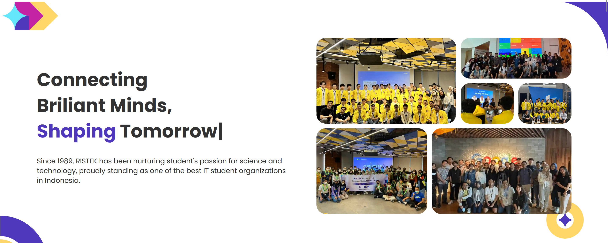
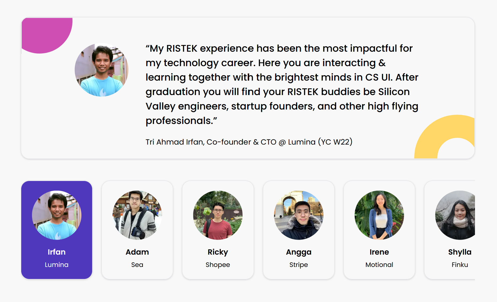
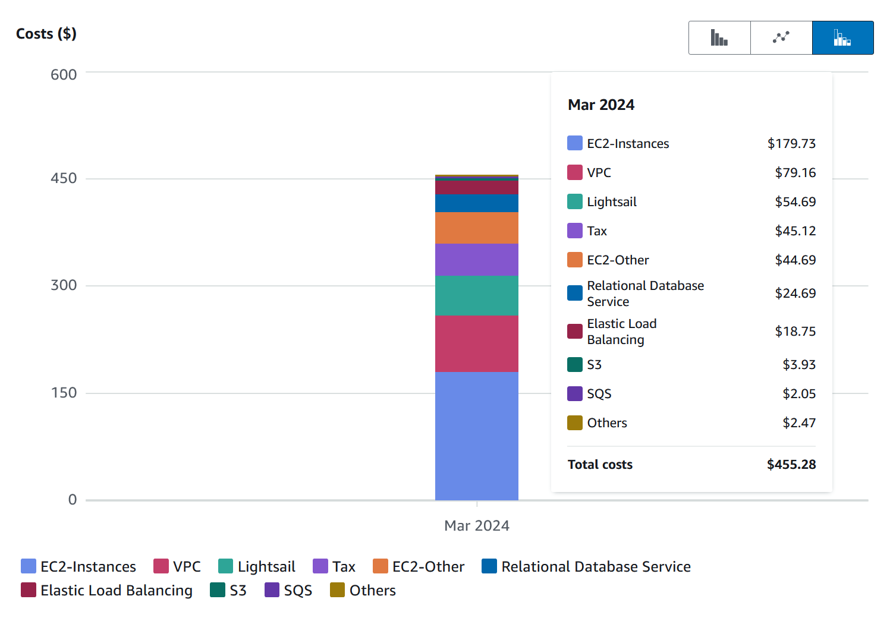
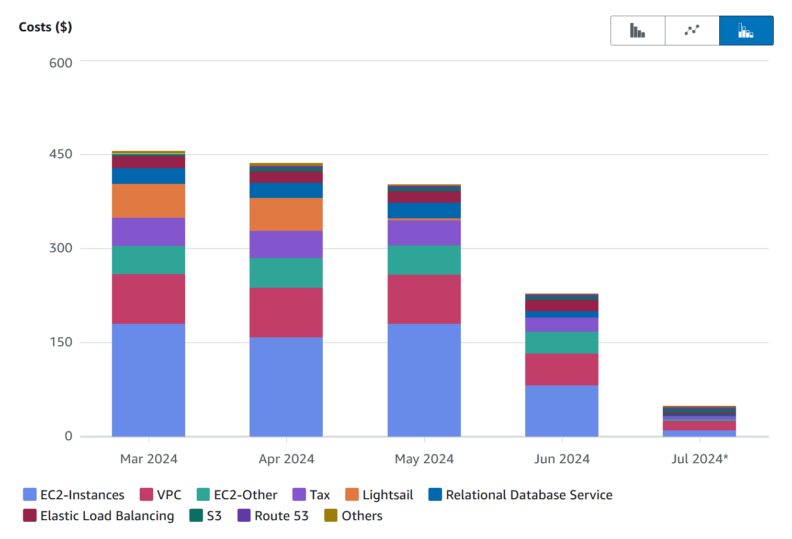

<!-- LINKS -->
[SusunJadwal]: https://susunjadwal.cs.ui.ac.id

It has been 6 months since I started my role as the Director of Engineering at [RISTEK](https://ristek.cs.ui.ac.id). In those 6 months, we have faced a fair share of challenges. One of the biggest and most imminent of them is reducing cloud costs. We managed to reduce our operating costs by 90% in under 2 months and I'm here to share it with you.

<!--truncate-->

## A bit of context...

_RISTEK's 2024 Landing Page_

### What is RISTEK?

RISTEK is an organization ran by the students of the Faculty of Computer Science (abbreviated as Fasilkom) at Universitas Indonesia. It has 35 years of history under its belt. RISTEK has produced a lot of impact to the community through its research and products. One of the first products we've made was [SusunJadwal] which is a web application to help students plan multiple class schedules in preparation for a new semester. RISTEK members have also been quite successful in national and international level competitions. A lot of the past members have become very successful people including, but not limited to, startup founders, renowned engineers, NGO builders, etc.

_Some of the past members at RISTEK_

Keeping all this in mind, RISTEK was primarily a learning organization. A lot of the activities revolve around socializing and learning new skills together. While this is a positive thing, RISTEK during this time had a pretty small reach and impact towards the outside world. It wasn't until 4 years ago that it became known as the biggest student-ran IT organization in the country.

### How RISTEK became as big as it is now

For over 4 years, RISTEK is undergoing a culture shift. Without sacrificing the initial goal for learning, we've become more focused on creating impact. As a result, we've produced several products that are widely used by the members of Universitas Indonesia such as the aforementioned [SusunJadwal] and even ones used on a national scale like [ristek.link](https://ristek.link). We have also handled cross-organizational projects such as the web application for Fasilkom's student orientation program, the student executive election website, and more.

This is indeed a good thing but creating a lot of products comes with its costs. And for us, one of the biggest cost that came from it is cloud costs.

_Of course it is..._

Luckily, we were fortunate enough to receive AWS credits. We actually managed to redeem them twice which should be enough for 4 years (as it will have expired by then). Woohoo, case solved! We can just do this over and over again right?

Well, if we could I wouldn't be writing this article right here :D

## The looming problems

There are several issues with this model of redeeming credits over and over again.

### 1. Lack of constraints

Because of the seemingly generous offer, we didn't think much of optimizing costs and can just provision new servers for each product. After all, that is the ideal thing to do right? Normally yes, but this makes us forget that we're a student organization: we're lucky to even have those credits to begin with. Under normal circumstances, we would be operating on a very strict budget. The abundance of credits makes us forget this and use them to provision resources without giving much thought on how it might impact the future.

### 2. Instability of the source

For context, we received 2 x 5000 USD worth of AWS credits. Because we managed to receive such a huge amount twice, it's easy to forget that the offer could change later down the line. This is exactly what happened in the present day: AWS only offer 1000 USD credits for startups and nonprofits which expires in 2 years. The conditions are even stricter now and we're not going to meet those any time soon.

### 3. Future changes in pricing

It's hard to know when a product you're currently using will change its price. Sometimes, it might never change at all. However, as of February 2024 (which is coincidentally also when I started my role as RISTEK's engineering director) AWS decided to charge 0.005 USD per hour for all resources using public IPs. This doesn't sound a lot at first, but trust me it adds up quick as you'll see soon enough.

## Color me surprised

Prior to starting my role, I had a rough idea about the situation but I wasn't told of the details. It was only after I came in that I realize the amount of work we had to do and how dire it is. As it turns out:

Our credits will only last until **March 2024**.

  

Okay maybe we have to pay a bit so what right? I'm sure the faculty can cover it. Right...?

  

:::warning Disclaimer
    I'm a student at a third world country. 455 USD may seem cheap for a lot of companies but for us, they are a ton of money.
:::

Yeah, we have GOT to reduce costs quickly if we want to survive. Fortunately, we have about 2.5 months of runway where we can handle 400+ USD monthly costs. The question is, how and where do we start?

## Analyzing the costs

### Addressing the elephant in the room

Based on the graph above, it's pretty clear that EC2, EC2 dependencies, and VPC charges are the major contributors with both of them adding up to **300 USD**. Almost all of our services are deployed on EC2 instances. There were 22 EC2 instances previously, each with their own specs. All of them had public IP addresses. I think it's pretty obvious that we can't rely on AWS anymore for compute and networking. It's also important to note that we don't really need 22 instances to run our products. As it turns out, we can operate on a much tigther resource (I'll write about it in another post).

Even without those two services, we still have 155 USD to handle. I'm certain we can significantly reduce that but how?

### Tackling the low hanging fruits (I'm sorry)

#### Deactivating Lightsail

I noticed the next biggest contributor was Lightsail, another compute solution with a 54 USD charge. Unlike EC2 however, I was not aware of any products or client projects that was using it. I wanted to terminate these instances but I had to make sure with the previous director of engineering and other stakeholders if they were still in use. 

I had expected around half of them to be safe but it turns out all of them were no longer in use!

I happily terminated all the Lightsail instances. That's an easy 54 USD reduction in costs. I can't believe it but I actually found a low hanging fruit (I'm sorry). It almost frustates me how simple this particular solution is yet no one bothered to try it. This made me wonder what other services are no longer in use.

#### Deactivating RDS

Up next on the list is Amazon RDS. I noticed that we're only using one database instance there which is used for our student orientation event. On first glance, it seemed like that instance was still in use. However, an EC2 instance with a similar naming scheme also existed and is currently running. The name of the instance seems to imply its purpose: hosting a database for the student orientation event. Two database instances for the same product on different services. 

When I looked into the VM, I noticed there was indeed a database running. Next, I decided to hop into the VM hosting the backend for the event. What I'm looking for is the configuration variable for the database url the backend will be using. Lo and behold, it was pointing at the EC2 instance discovered earlier instead of the RDS instance. I felt like we're about to reduce another significant portion of our costs but before terminating the instance, I decided to confirm with the previous developers for the orientation event web applications.

Sure enough, the RDS instance was no longer in use. I made a backup of the database and proceeded to terminate it. Another 24 USD saved!

### An extra cost reduction

So up until now, we easily saved 78 USD without doing much. However, in actuality we've cut down more than what we had expected due to tax! In reality, we managed to cut 85 USD in total. Still far from what we aimed for but with how minimal of an effort it took, it's definitely worth it.

### So, how much will we actually need?

455 - 85. We still have 370 USD left to cut down. I mentioned earlier 300 USD was purely on EC2, EC2 dependencies, and VPC charges. About 18 + 1.8 USD or 20 USD when rounded up is on Elastic Load Balancing which is mostly due to autoscaling groups for EC2 instances. Oh, I forgot to add 30 USD for the EC2 and VPC taxes. When we're done with all of the above, we will only require 455 - 330 - 85 - 20 which is only **20 USD**!

Now there will be fluctuations but even then it will only be 30 USD at most. This is mostly for storage, container registries, etc. We are ok with all of them remaining in AWS as the growth in costs for these services are quite slow and won't affect us as much for the time being.

All we have to do now is migrate our way out of EC2 and into other alternatives.

## The great migration

### The deployment targets

Firstly, we have to determine where we want to host our services. There are multiple options, some services have different reliability and availability requirements than the rest. Some services need to have high availability and handles a pretty high load most of the time. Some services have low availability requirements and only handle moderately high traffic in certain periods and remain idle for the majority of the yar. Mostly though, our services can work with a decent level of availability (90-95%) and handle a low to moderate amount of requests on average.

With this in mind, we decided to go with a multi-cloud setup. Our HA and high traffic services will be deployed on GCP. You're probably thinking, 

 
> _Why on earth would you go for GCP if you want to cut costs?!_
 

Well, lucky for us we have a collaboration program with GCP which allows us to have access to credits which are enough for our needs. Our seasonal services are deployed on the servers in our faculty. We managed to get our hands on a couple of VMs that we can use.

Finally, for the majority of our services we decided to go for a decent yet affordable VPS provider. We rented 2 servers there which is surprisingly more than enough to have the luxury for monitoring and redundancy. Each VM costs 10 USD per month. So we only have to spend an extra 20 USD!

Now that we've settled on the deployment targets, it was time to migrate these services to them.

### The path to victory is never that easy...

This is far easier said than done of course. There were several challenges we encountered during this process.

Firstly, the timeline. At this point in time, we barely have more than 2 months to migrate these services before running out of our emergency funds. We have to migrate services from 22 servers without any data loss and functional failures. Which brings is to our next issue: manpower shortage

Before assuming my role at RISTEK, there was no division dedicated to handling technical operations such as infrastructure, developer experience, site reliability, etc. It was almost a solo effort by the previous director of engineering. That might've worked then, but now we absolutely need a division like this to help spread the work. I decided to create a new division called Technical Operations (what a creative name I know). The problem is, there wasn't a lot of people who I know can handle this sort of work. The ones that do either have something going on already or are RISTEK members in other divisions. In the end, I only managed to find 2 people that I trust can handle this and have the time to do so. So including me, we only have 3 pairs of hands on deck.

To make things worse, pretty much all of the services was deployed manually. The configurations were mostly isolated in each VM too and sometimes it's not entirely working. Other times, we have to contact previous developers about the deployment and configuration. With only 2 months, we definitely have our work cut out for us.

### ...but we shall push through regardless!

I decided to allocate around a month purely to research and come up with a migration plan so we can make it on  time. The most obvious thing to do other than gather all the context and configurations is to containerize and automate the deployments. We decided to use Docker and GitHub Actions for both purposes. To speed things up, I decided to standardize the workflows to build an image so that it can be called by each service repository. These workflows are known as [reusable workflows](https://docs.github.com/en/actions/using-workflows/reusing-workflows) at GitHub and we store them all in one repository.

The next step, is to configure the deployments. Compared to a traditional approach where each repository handles its own deployments, I decided to separate the process. The image builds are done in each repository either by pull request merges or manual dispatches. A successful image build will then trigger a deployment in a central configuration deployment repository based on the service that triggers it.

But why should we do it like this?

### The beauty of self-documentation and secret managers

Earlier I mentioned that there was no source of truth and documentation regarding the deployment and secrets of a service. The central deployment repository solves both! Since all deployments are configured here using Docker Compose and Bash scripts, we also documented how each service is deployed and where as a side effect. We also made use of a free secret manager to host the secrets for each service. The right secrets are then fetched based on a configuration file format we created which contains the environment, the project it's located at in the secret manager, and the path to the service's directory. This allows us to inject the secrets at runtime during the deployment workflow.

:::info
    I would like to shout out [Teknologi Umum](https://teknologiumum.com) as I used their [infrastructure](https://github.com/teknologi-umum/infrastructure) repository as a reference.
:::

We enhanced the flow used at Teknologi Umum so that we can select which services and on which servers we want to deploy them before running the deployment which is useful for both repository-triggered and manual deployments. The inputs are then validated to a configuration file at the root of the deployment repository which dictates where a service is deployed and what servers are available. And all it took, was a few Python scripts to do the job.

With this setup, we successfully migrated 100% of the services and their data from EC2 into their specified deployment targets within a single month. We even have spare time to deploy a new web application for our summer events. The flow was so smooth that it took less than 30 minutes to setup the deployments both staging and production environments for it. Once we've confirmed a service is fully operational with no issues, we terminate their previous EC2 instance.

## So, how much did we end up saving?

We actually went slightly over the deadline which is why in July it was around 40 USD. But after looking through the cost estimate for this month, it's only around 25 USD. Add 20 USD for the new servers outside of EC2 and we have a grand total of **45 USD**!

In only 2.5 months, we not only saved 90% of our original costs but also automated, standardized, and centralized the secrets of 100% of our service deployments.

## Conclusion

With this out of the way, we can allocate our funds for other stuff that needs more attention. We can definitely push it down further but that's a project for another time. 

I'm quite proud of the results considering RISTEK's Technical Operations team is only a few months old and consists of only 3 people including myself. Of course, the credit is not just given to us. We managed to do it thanks to the support of other divisions and previous members of RISTEK which provided us with what we need to do our job. This article is my way of sharing the experience in hopes that it can be of use to you.

If you're interested in the details of the deployment system we built, I'll be writing a separate post about it. Thanks for reading this far and I'll see you next time~