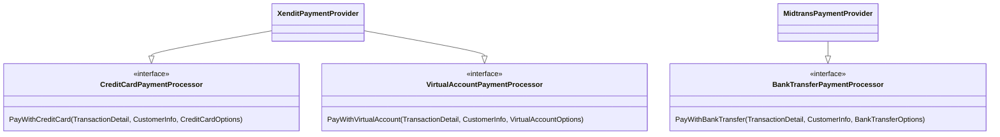

If you've been writing software for a while, you probably know of design patterns. It's often associated with object-oriented programming and Java has a lot of those in the ecosystem. A lot of people see it as needless abstractions that only has use in OOP languages such as Java. While I personally believe that not all of these patterns are actually that useful, one pattern is actually used a lot in production systems outside of Java whether people realize it or not. That pattern is known as the Strategy pattern and we will be using it to design a payment system.

<!--truncate-->

## A case study on payment systems

:::warning Disclaimer

This is only a simplified representation of what a payment system can look like. The purpose of this article is to demonstrate how the Strategy pattern can be used to implement an extensible and maintainable payment system but not the actual processing of payments itself. There are better and more complete resources out there if that's what you're looking for.

:::

To illustrate how strategy patterns can be useful, let's take a simplified case of a real-world component that's present in most businesses: **payments**. A business can accept payments from different methods nowadays such as bank transfers, virtual accounts, online wallets, QR payments, etc. It would be tough to implement them from scratch. Luckily, a sector of business exists solely to provide us with the ability to add payments with little-to-no hassle. These businesses are called payment gateways. There are a number of popular payment gateways in Indonesia with each supporting their own subsets of payment methods such as Xendit and Midtrans.


Let's say we want to support some methods that are only available in Xendit and some that are only available in Midtrans. How can we integrate that into our system?

## Version 0: Naive If-Else

Perhaps we want to support three methods:

- Bank Transfer
- Credit Card
- Virtual Account

Intuitively, we can sketch out something like this in Golang

```go
type PaymentMethod uint

const (
    BankTransfer PaymentMethod = iota + 1
    CreditCard PaymentMethod
    VirtualAccount PaymentMethod
)

// The xendit and midtrans field are not actual code but just an example of what it could look like
type PaymentService struct {
    xendit xendit.Gateway
    midtrans midtrans.Gateway
}

type TransactionDetail struct {
    // just a struct to help provide info about the payment
}

type CustomerInfo struct {
    // just a struct to help provide info about the payment
}

var (
    ErrUnsupportedPaymentMethod = errors.New("unsupported payment method")
)

func (p *PaymentService) ProcessCustomerPayment(ctx context.Context, method PaymentMethod, transactionDetail TransactionDetail, customerInfo CustomerInfo) error {
    if method == BankTransfer {
        // process bank transfers with midtrans 
    } else if method == CreditCard {
        // process credit card payment with xendit
    } else if method == VirtualAccount {
        // process virtual account payment with xendit
    }

    return ErrUnsupportedPaymentMethod
}
```

Now, there are two problems here. Firstly, what happens if we want to support more payment methods in the future? We will have to add more if-else statements which can clutter the code real fast. Secondly, payments are usually complex and can take a lot of code to process. Given enough payment methods, this function will be very hard to reason and maintain soon enough. This is a clear case where the Strategy design pattern is useful.

## Let's use strategies!

The Strategy pattern, is a design pattern that's useful when you want to do one specific thing and there are many different ways to do it. Payments actually fit into this case. Credit cards, virtual account, and online wallets are all different, but they are still doing one thing and that is payments. We could design a strategy for each method and have the gateways implement them as needed.

<center>



</center>

In this case, we want to use Xendit for CC and virtual account payments and Midtrans for bank transfers. The diagram above shows how easy it is to implement an existing strategy for a payment gateway and adding new payment methods by adding new strategies. We can extend and modify only some method of payments on some gateways without disrupting the other ones. Let's see how that looks in code form. Let's implement the basic structs and interfaces for now.

```go title="payment.go"
type PaymentMethod uint

const (
    BankTransfer PaymentMethod = iota + 1
    CreditCard PaymentMethod
    VirtualAccount PaymentMethod
)

type TransactionDetail struct {
    // just a struct to help provide info about the payment
}

type CustomerInfo struct {
    // just a struct to help provide info about the payment
}

type BankTransferOptions struct {
    // ...
}

type CreditCardOptions struct {
    // ...
}

type VirtualAccountOptions struct {
    // ...
}

var (
    ErrUnsupportedPaymentMethod = errors.New("unsupported payment method")
)

type PaymentService struct {
    xendit XenditPaymentProvider
    midtrans MidtransPaymentProvider
}

type BankTransferPaymentProcessor interface {
    PayWithBankTransfer(context.Context, TransactionDetail, CustomerInfo, BankTransferOptions) (id string, err error)
}

type CreditCardPaymentProcessor interface {
    PayWithCreditCard(context.Context, TransactionDetail, CustomerInfo, CreditCardOptions) (id string, err error)
}

type VirtualAccountPaymentProcessor interface {
    PayWithVirtualAccount(context.Context, TransactionDetail, CustomerInfo, VirtualAccountOptions) (id string, err error)
}

func (s *PaymentService) ProcessCustomerPayment(ctx context.Context, method PaymentMethod, detail TransactionDetail, cust CustomerInfo) error {
    switch method {
        case BankTransfer:
            return s.ProcessBankTransfer(ctx, detail, cust, s.midtrans)
        case CreditCard:
            return s.ProcessCreditCardPayment(ctx, detail, cust, s.xendit)
        case VirtualAccount:
            return s.ProcessVirtualAccountPayment(ctx, detail, cust, s.xendit)
    }

    return ErrUnsupportedPaymentMethod
}
```

Whew, that's a lot. Take a minute or two to let it sink in. Essentially, we've added the payment method strategies as interfaces. We also refactored our `ProcessCustomerPayment` method to call other methods which are specific to the payment methods alongside the processor. This is where we will see the Strategy pattern shine. Let's write out the rest of the methods

```go title="payment.go continued"
// ...all the previous stuff

func (s *PaymentService) ProcessBankTransfer(ctx context.Context, detail TransactionDetail, cust CustomerInfo, processor BankTransferPaymentProcessor) error {
    opts := BankTransferOptions{} // specify the options and configuration

    id, err := processor.PayWithBankTransfer(ctx, detail, cust, opts)
    if err != nil {
        return err
    }

    // Do something else such as saving the details to a database, triggering a webhook, etc.
    return nil
}

func (s *PaymentService) ProcessCreditCard(ctx context.Context, detail TransactionDetail, cust CustomerInfo, processor CreditCardPaymentProcessor) error {
    opts := CreditCardOptions{} // specify the options and configuration

    id, err := processor.PayWithCreditCard(ctx, detail, cust, opts)
    if err != nil {
        return err
    }

    // Do something else such as saving the details to a database, triggering a webhook, etc.
    return nil
}

func (s *PaymentService) ProcessVirtualAccount(ctx context.Context, detail TransactionDetail, cust CustomerInfo, processor VirtualAccountPaymentProcessor) error {
    opts := VirtualAccountOptions{} // specify the options and configuration

    id, err := processor.PayWithVirtualAccount(ctx, detail, cust, opts)
    if err != nil {
        return err
    }

    // Do something else such as saving the details to a database, triggering a webhook, etc.
    return nil
}
```

If you noticed, the type of the `processor` attribute is actually the interface we used based on the payment method. By implementing it like this, the service doesn't need to know the provider it is using to process the payment; it should only care that it can process the payment as expected. This is important because now, we can accept any payment gateway we want and implement the strategy interfaces to support the method and call it through the `ProcessCustomerPayment` method. Adding and modifying payment processing can now be done in isolation without affecting the rest of the service!

## Implementing the payment processing strategies

Let's finish off the rest of the implementation

```go title="xendit.go and midtrans.go"
// file: xendit.go

type XenditPaymentProvider struct {
    xendit xendit.Gateway // This is just a simplified version of the Xendit SDK
}

func (g *XenditPaymentProvider) PayWithCreditCard(ctx context.Context, detail TransactionDetail, cust CustomerInfo, opts CreditCardOptions) (id string, err error) {
    // Do some logic with xendit

    return id, nil
}

func (g *XenditPaymentProvider) PayWithVirtualAccount(ctx context.Context, detail TransactionDetail, cust CustomerInfo, opts VirtualAccountOptions) (id string, err error) {
    // Do some logic with xendit

    return id, nil
}

// file: midtrans.go

type MidtransPaymentProvider struct {
    midtrans Midtrans.Gateway // This is just a simplified version of the Midtrans SDK
}

func (g *MidtransPaymentProvider) PayWithBankTransfer(ctx context.Context, detail TransactionDetail, cust CustomerInfo, opts BankTransferOptions) (id string, err error) {
    // Do some logic with Midtrans

    return id, nil
}
```

That's it. We've now succesfully designed a payment system that we can easily extend for additional payment methods. All we have to do is create a new strategy for the related method and implement it using our payment gateway of choice. Neat!

## So, are design patterns worth it?

This is a tough question. Most of the design patterns proposed by the Gang of Four isn't really used that often. It can even add complexity if misused. However, some patterns definitely have a place in good software engineering practices such as Strategy, Factory Method, Observer, etc. I also deliberately wrote the examples here in Golang to show that design patterns aren't just arcane contraptions of the OOP and Java world: it's a set of patterns that can be applied to problems, regardless of the programming language used. As all things are though, we shouldn't be too dogmatic in our approach and either adapt the patterns to our needs or just don't use it if it's not the right fit. As a fun fact to conclude this post, I used both the Strategy and Factory Method pattern in a recent Python project and it really improved the extensability of our system. So don't knock it until you try it!

## References

- [Payment Gateway Indonesia: Revolutionizing Digital Transactions](https://www.onebrick.io/blog/apa-itu-payment-gateway-indonesia)
- [Xendit and Midtrans Payment Methods](https://www.xendit.co/wp-content/uploads/2021/11/Cleanup-MidtransArtboard-1-copy@2x-r1.png)
- [Midtrans alternative for your payment needs](https://www.xendit.co/en/midtrans-alternative/)
- [Strategy pattern](https://refactoring.guru/design-patterns/strategy)
- [Factory Method pattern](https://refactoring.guru/design-patterns/factory-method)
- [Strategy in Go / Design Patterns](https://refactoring.guru/design-patterns/strategy/go/example)
- [Gang of Four - Design Patterns: Elements of Reusable Object-Oriented Software (Addison-Wesley Professional Computing Series)](https://github.com/media-lib/prog_lib/blob/master/general/Gang%20of%20Four%20-%20Design%20Patterns%20-%20Elements%20of%20Reusable%20Object-Oriented%20Software.pdf)
- [Payment methods | Midtrans](https://midtrans.com/features/payment-methods)
- [Online Payment Methods | Xendit](https://www.xendit.co/en-id/products/all-payment-methods/)