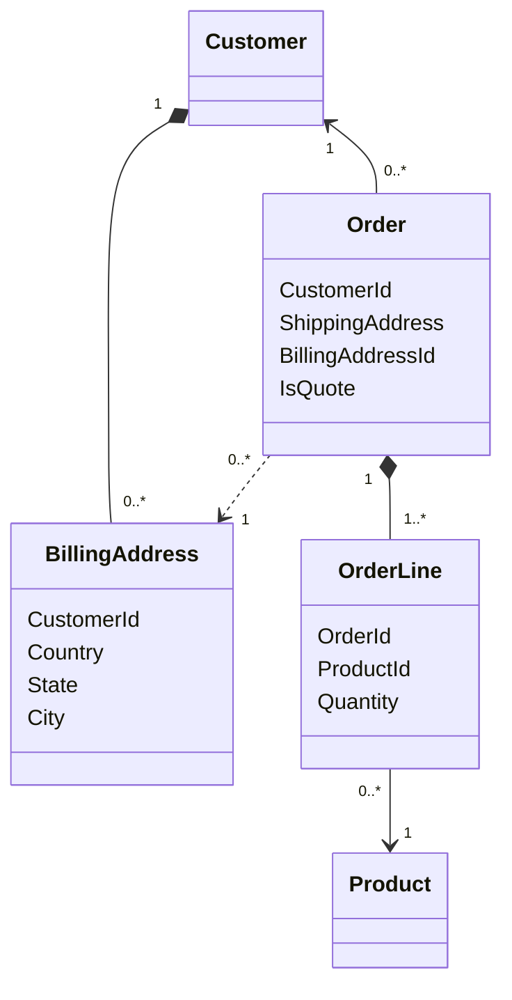

Separation of concerns is a concept that's often mentioned when discussing maintainable code. It's also the underlying philosophy for some aspects of well-tested patterns and architectures such as domain-driven design and layered architecture. One example of how separation of concerns is applied is by separating the objects in the domain layer from the persistence layer. There are a myriad of resources that discuss the terminologies and concepts of how it looks like in the pattern. We won't be covering that in this post. Instead, I want to explain the intuition rather than the technical details and how it can help you write better code.

<!--truncate-->

## Which came first: the chicken or the egg?

So a common thing I see for some engineers is they often write their structs based on where they will be storing it. For example, people tend to start their design by making diagrams of database tables

<center>



</center>

For most people, including myself, it makes sense to try and sketch out the objects that a system will have and how they relate to each other. However, by doing this we are indirectly fitting the design to the database instead of the domain. This makes it tougher to communicate about the models to users and stakeholders of the system. As quoted by Scott Wlaschin in his book regarding domain-driven design (DDD) using a functional paradigm:

> _The concept of a “database” is certainly not part of the ubiquitous language. The users do not care about how data is persisted._

Designing a system that is intended to be decomposed from it's storage/persistence is called [persistence ignorance](https://learn.microsoft.com/en-us/archive/msdn-magazine/2009/june/the-unit-of-work-pattern-and-persistence-ignorance). It's a principle that helps us focus our design on the domain of the problem instead of the database. Designing from the database can warp our design in a way that misses the nuance and context of the problem.

The example above ignores the difference between an order and a quote. It's possible that we later found out that a quote should not have a billing address as it's a different thing compared to an order. We can always fix it but there could be other issues that a change in the database schema can't really help much if the context of the domain is not well represented. It's best to start from the problem and requirements of the system and identify how the objects in the system interact based on the logic instead of trying to model the database tables/classes early on. Now, assuming that we've defined what defines an order, how to make them, as well as how to add and remove items from an order, how should we model them?

## Decoupling the chicken from the egg

Often if a system is relatively simple, this isn't too important. But designing a system that has a lot of objects and relations can result in objects that muddles the details of persistence too much within the domain. For these kinds of systems, it can be worth it to separate the domain objects that will interact and have behavior in the system from it's database representation.

For example, when making an `Order`, the behavior of adding, updating, and removing the line items should be represented in the object of the domain. The underlying database shouldn't leak and matter into the logic itself. When the order is actually saved or queried, a separate object is created as an interface to the persistence layer. How the data from the domain is stored and retrieved should not be the concern of the domain. This isn't a concept unique to DDD; you can implement this without the other concepts in DDD. However, concepts from DDD makes it easier to implement this.

Let's try and see how this could work.

## Designing the chicken farm

### Implementing the domain objects

Let's focus on `Order` and `OrderLine` from the time being. When a customer wants to make an order, they can add, remove, and modify the items on it. Based on how shopping works in the real world, it's impossible to have a line item that's not part of an order. It wouldn't really make any sense either. Based on this information, we can come up with something like this.

```python
class OrderLine:
    id: str
    product_id: str
    quantity: str

class Order:
    id: str
    customer_id: str
    order_lines: list[OrderLine]

    def add_item(self, order_line: OrderLine):
        # No need to add the same item into the list
        for item in self.order_lines:
            if item.product_id == order_line.product_id:
                return
        self.order_lines.append(order_line)

    def remove_item(self, order_line_id: str):
        # We can make this idempotent so attempting to delete an item that doesn't exist
        # won't matter or disturb the flow
        for i in range(len(self.order_lines):
            if self.order_lines[i].id == order_line_id:
                del self.order_lines[i]
```

This is fairly easy to follow and we can see how the requirements of ordering can be made in the code without any persistence concerns for now.

### Implementing the persistence layer with repositories

The component responsible for interacting with persistence infrastructures is the repositories. Here's where the separation begins to shine: at this point, we don't really need to care about how orders are stored yet. We can focus our work on making sure the logic is correct first before diving into the details of storage. This may be a bit wasteful for simple and small-to-medium systems. However, this is a fairly quick and easy technique to build a proof of concept on a large and complex system to verify that the requirements are correct before actually implementing the storage and other details. We can just implement an in-memory store for now.

```python
from abc import ABC, abstractmethod

class OrderRepository(ABC):
    @abstractmethod
    def find_by_id(self, order_id: str) -> Order | None:
        pass

    @abstractmethod
    def find_by_customer_id(self, customer_id: str) -> list[Order]:
        pass

    @abstractmethod
    def save(self, order: Order):
        pass

    @abstractmethod
    def remove(self, order_id: str):
        pass

class InMemoryOrderRepository(OrderRepository):
    orders: dict[str, Order]

    def find_by_id(self, order_id: str) -> Order | None:
        if order_id in self.orders:
            return self.orders[order_id]
        return None

    @abstractmethod
    def find_by_customer_id(self, customer_id: str) -> list[Order]:
        customer_orders = []

        for _, order in self.orders.items():
            if order.customer_id == customer_id:
                customer_orders.append(order)

        return customer_orders

    def save(self, order: Order):
        self.orders[order.id] = order

    def remove(self, order_id: str):
        if order_id in self.orders:
            del self.orders[order_id]    
```

Note that we defined an interface/abstract class for the repository before implementing it. This makes it easy if we want to switch from an in-memory implementation to an actual database once we've understood the domain properly. Changing the repository used on the domain/service layer will require no changes as it can just use the contract defined on `OrderRepository`. Whether we use `InMemoryOrderRepository` or perhaps a future SQL implementation such as `SQLOrderRepository` is not a concern of the domain and should not affect how the business logic is implemented.

## Is the farm always necessary?

Just like everything, there's no one-size-fits-all solution to how we design systems. DDD and domain-persistence separation can be very useful to write maintainable and clear systems that are large and complex. However, if we're building small and composable systems where it would be faster and more maintainable to build a system without all of that, then it might not be necessary to separate it. 

One thing I also want to point out is that DDD and other design patterns don't have to be constricted to OOP heavy languages such as Java, C#, etc. It can also work well with more simple and procedural languages such as Python, Go, and even functional languages like F#. Just be sure to not be to dogmatic and apply it only where it fits and modify it to your needs. Personally, it has always helped me and my teams, especially when we're building something relatively complex where we want to keep the components and layers separate to make it easier to extend or modify it. Hope you learned something today!

## References

- [Eric Evans - Domain-Driven Design: Tackling Complexity in the Heart of Software](https://www.oreilly.com/library/view/domain-driven-design-tackling/0321125215/)
- [Scott Wlaschin - Domain Modeling Made Functional: Tackle Software Complexity with Domain-Driven Design and F#](https://www.oreilly.com/library/view/domain-modeling-made/9781680505481/)
- [Patterns in Practice - The Unit Of Work Pattern And Persistence Ignorance](https://learn.microsoft.com/en-us/archive/msdn-magazine/2009/june/the-unit-of-work-pattern-and-persistence-ignorance)
- [Using tactical DDD to design microservices](https://learn.microsoft.com/en-us/azure/architecture/microservices/model/tactical-ddd)
- [DDD When should I create a domain object and a persistence object instead of using a persistence object as a domain object?](https://stackoverflow.com/questions/33268944/ddd-when-should-i-create-a-domain-object-and-a-persistence-object-instead-of-usi)