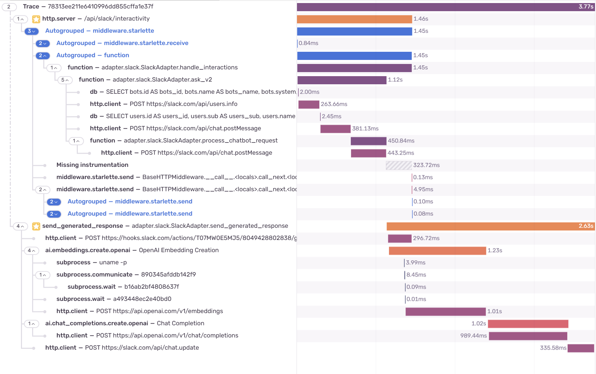

Perhaps the most crucial thing to do before deploying your applications to production is to make sure that you can monitor and act quickly in case of failures. A quick Google search will show you terms such as metrics, logs, and distributed tracing. For monolithic systems, the first two covers almost everything you need to track and identify issues. When you have multiple services interacting with each other, distributed tracing helps a lot, especially if you have a high rate of requests where it's hard to get anything from logs alone. What some may not realize is that distributed doesn't always mean different services. Tracing processes in different threads and correlating them is also a case of distributed tracing...well not quite but that's what we'll be discussing here. I will also show you how to do that with Sentry.   

<!-- truncate -->

## What is distributed tracing?

Tracing is the act of following a request and tracking what, when, and how long it happened for each part of the system being traced. It gives us a bird's eye view on how requests move within the system and where which provides us with insight about how a user's experience may look like. It's often used as a step to locate the part of a request that may have caused or indicate a problem before diving into logs.

Distributed tracing is similar to tracing but instead we look at the flow of data for a request in a distributed systems environment. In bigger systems, a single user request may move through many different services before resolving and delivering the response that is intended.

<center>


_Example trace of a logistics flow for shipment_

</center>

I won't be covering all concepts of tracing but here are some to get you up to speed.

### Traces

Traces represent the entire lifecycle of a request/flow of data. A single request may flow through different functions in the case of normal tracing and can go through different applications and subsystems in distributed tracing. On the picture above is an example trace of a request hitting the `/shipment/:id` endpoint of the `logistics` service. Traces can be identified by the `trace_id` field in most tools.

### Spans

Traces are made up into segments which when composed together represents the entire trace. These individual segments are called spans. Spans represents a specific step in the request lifecycle and what happens in it. Spans are organized in a tree-based structure: spans can have child spans inside of them. This is useful as we may care about sub-activities which are represented by these child spans that may happen inside of a span. We can see this happening in the picture above. The `logistic processing`, `SQL select`, and `fetch status from tracking service` spans are all siblings and they all are child spans of the `get shipment request` span. However, the `fetch status from tracking service` span is composed of several child spans from the `tracking` service where they represent what happens when the `tracking` service is called. The topmost span AKA the span with no parent spans is the root span and it represents the entirety of the trace from start to finish. Spans are identified by the `span_id` field in the majority of tools.

### Baggage

Sometimes your traces may travel through separate services in a single lifecycle. You can categorize these traces by adding contextual data into them such as a transaction id that you want to keep track of. Often, you want this data to persist even when the trace is propagating to other services where the data may not be obtainable anymore. You can accomplish this by using baggages. In web applications, these data can be propagated between services by sending it as a `baggage` header where the data is sent as a bunch of key-value pairs. The downstream services can read the data from the `baggage` header and add it as attributes to any spans it may generate in the process.

You can learn more about traces and other forms of telemetry for observability from the [OpenTelemetry documentation](https://opentelemetry.io/docs/concepts/signals/) if you'd like.

## Distributed tracing? More like multithreaded tracing

When we talk about distributed tracing, we don't necessarily mean different applications or different backends. Distributed tracing and distributed systems have gained a lot of correlation to the microservices architecture. However, distributed systems aren't only microservices. In a multithreaded setting for example, each thread can be viewed as its own component in the system that's looking to resolve several tasks concurrently and/or asynchronously as part of a bigger task. Different threads have their own context and scope which means they are pretty much different "services" or transactions in the world of Sentry and tracing. But enough talking. Let's dive into an example that I actually encountered in a project of mine.

## A case study of multithreaded tracing in Slack Chatbots

So a feature I was developing involved building a chat bot application where users can interact with the bot through Slack. The users can use a slash command like `/askbot` to invoke the bot and it will return a form. Users can fill in the bot they want to use as well as the question. After entering submit, the question and bot choice is sent to the backend and the response will then be generated and sent as a thread in Slack. Simple right?

### I love timeouts!!!

So Slack interactions and commands have a limit on how long they will wait for a response before triggering a timeout. Slack has a maximum of 3 seconds before a timeout happens. The request can still resolve in the background but it leaves users with an unpleasant user experience where errors happen when they aren't really supposed to. To solve this, we can generate and send the response asynchronously by offloading it into a different thread and return an early 200 response alongside a loading message to indicate that the question is being processed by the system.

```python
def send_generated_response(
    self,
    channel: str,
    ts: str,
    engine: ChatEngine,
    question: str,
    access_level: int,
):
    self.logger().info("generating response")

    try:
        chatbot_response = engine.generate_response(
            query=question, access_level=access_level
        )
        self.logger().info("sending generated response")
        self.app.client.chat_update(
            channel=channel, ts=ts, text=chatbot_response
        )

    except ChatResponseGenerationError as e:
        sentry_sdk.capture_exception(e)
        self.logger().error(e)
        self.app.client.chat_update(
            channel=channel,
            ts=ts,
            text="Something went wrong when trying to generate your response.",
        )

async def process_chatbot_request(
    self,
    chatbot,
    question,
    channel_id,
    thread_ts,
    access_level=1,
    history=None,
):
    # ...other processing involved early on

    send_response_thread = threading.Thread(
        target=self.send_generated_response,
        kwargs={
            "channel": channel_id,
            "ts": loading_message["ts"],
            "engine": bot_engine,
            "question": question,
            "access_level": access_level,
        },
    )

    send_response_thread.start()

    return Response(status_code=200)
```

### Hidden in plain sight

There are at least two problems for this implementation. Firstly, the processing time that can be recorded based on logs and from a glimpse by the user is only the time it takes to send a loading message and returning the 200 response. However, the time it takes for users to actually receive their answers or an error is actually longer and we have no way of tracking this since no timing information is included at all. We can add a start and end time but it would be hard to correlate it with the previous response. Secondly, running a function in a different thread isolates its context and if we had included a `trace_id` in the logger before, it wouldn't be present in the current thread without messing around with the contexts a bit. This makes it impossible to correlate the actual processing with the original 200 response.

### Tracing your calls

Fortunately, we can instrument our code with traces with Sentry. Sentry allows automatic instrumentation so we don't have to add special function calls or modify the code for the majority of things such as http clients, http servers, database calls, etc. We can also use its `trace_id` and propagate it to loggers and other threads so that it has access to the `trace_id`, making it easy to correlate them. For manual instrumentation, it's mostly enough to add the `sentry_sdk.trace` decorator to the functions we want to instrument.

```python title="Instrumenting functions with the trace decorator"
@sentry_sdk.trace
async def process_chatbot_request(
    self,
    chatbot,
    question,
    channel_id,
    thread_ts,
    access_level=1,
    history=None,
):
    # ...
    pass

@sentry_sdk.trace
def send_generated_response(
    self,
    channel: str,
    ts: str,
    engine: ChatEngine,
    question: str,
    access_level: int,
):
    # ...
    pass
```

We can see the results below.


This is cool. But if you notice, this trace is actually incomplete. Our `send_generated_response` call is missing and we failed to trace the function call that's in a different thread.

### Propagating the traces

Let's check what we're doing wrong based on [Sentry's documentation on threading](https://docs.sentry.io/platforms/python/troubleshooting/).

> The general recommendation is to have one isolation scope per "concurrency unit" (thread/coroutine/etc).

Based on this information, threads are actually scoped in isolation from each other. This means, we can't just use the `trace` decorator since it assumes that the child span is in the same thread as the parent. We need to start a a new transaction instead inside of the `send_generated_response` and correlate it with the `trace_id` we have to make the spans of `send_generated_response` show in our trace.

```python title="Instrumenting the send_generated_response function by starting a new transaction with trace propagation."
def send_generated_response(
    self,
    channel: str,
    ts: str,
    engine: ChatEngine,
    question: str,
    access_level: int,
):
    transaction = sentry_sdk.get_current_scope().transaction
    if transaction is not None:
        trace_id = transaction.trace_id
    else:
        trace_id = ""

    with self.logger().contextualize(trace_id=trace_id):
        self.logger().info("generating response")

        with sentry_sdk.start_transaction(
            trace_id=trace_id,
            op="send_generated_response",
            name=f"{__name__}.{self.send_generated_response.__qualname__}",
        ):
            try:
                chatbot_response = engine.generate_response(
                    query=question, access_level=access_level
                )
                self.logger().info("sending generated response")
                self.app.client.chat_update(
                    channel=channel, ts=ts, text=chatbot_response
                )

            except ChatResponseGenerationError as e:
                sentry_sdk.capture_exception(e)
                self.logger().error(e)
                self.app.client.chat_update(
                    channel=channel,
                    ts=ts,
                    text="Something went wrong when trying to generate your response.",
                )
```

### Wait, shouldn't we use `baggage` and `continue_trace`?

This is a bit different from how the trace propagation works with the `baggage` header if we're calling a different service. Instead, we first get the `trace_id` and current transaction based on the current scope of the thread. However, we don't simply start a new span but we have to start a new transaction where the `trace_id` is specified. This tells Sentry that the current transaction is not a new trace but instead is a continuation of an existing one. If you noticed, we also remove the `sentry_sdk.trace` decorator for this function. The reason is because we don't actually need it: the decorator is only useful if a transaction is already running. Meanwhile, we only started a new transaction inside of the `send_generated_response` so the `sentry_sdk.trace` won't actually track anything and we can safely remove it.

Due to how scope works in different concurrency units, this allows us to mimic the behavior of calling `continue_trace` which is what we normally use for propagating traces with `baggage` in calls to another service.

<center>


_The complete trace which includes `send_generated_response`_

</center>

It worked! We can actually see the complete time it takes for users to get an answer for their question. This is just an example of how distributed tracing can be useful. We can use it to get a complete picture of what the user feels, identify bottlenecks, detect where a failure happens within a system, and more. We also learned how we can propagate our traces for multithreaded programs in a manner that mimics distributed tracing to give us a complete picture of what happens in concurrent and parallel environments. Until next time~

## References

- [Signals | OpenTelemetry](https://opentelemetry.io/docs/concepts/signals/)
- [Traces | OpenTelemetry](https://opentelemetry.io/docs/concepts/signals/traces/)
- [Baggage | OpenTelemetry](https://opentelemetry.io/docs/concepts/signals/baggage/)
- [Distributed Tracing | Sentry](https://docs.sentry.io/concepts/key-terms/tracing/distributed-tracing/)
- [Distributed Tracing for Microservice Architecture / Habr](https://habr.com/en/articles/539022/)
- [Trace Propagation | Sentry for Python](https://docs.sentry.io/platforms/python/tracing/trace-propagation/)
- [Troubleshooting | Sentry for Python](https://docs.sentry.io/platforms/python/troubleshooting/)