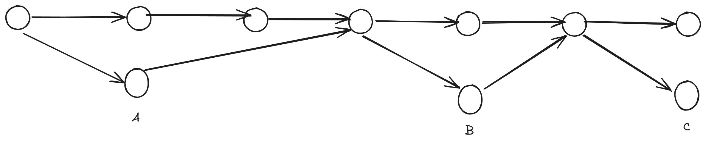
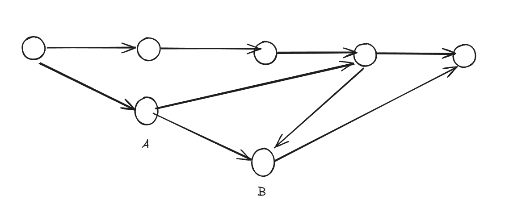

If your team uses a strategy like trunk-based development, chances are you make small PRs that get merged and deployed quickly on the trunk. For a lot of cases, you can just wait until a coworker reviews it and you can move on to other tasks in your backlog. But what if your tasks form a dependency chain with each other? You can wait and move on to other tasks and then- oh right. The tasks depends on the previous task. Well, I guess you're stuck. Or are you?

## The problems of trunk-based development

If your team is hell bent on using trunk-based development dogmaticly, you're bound to run into problems like the one I described above. Trunk-based development works by creating small and short-lived branches from the trunk and merging them once the PR is approved. It allows teams to move in a fast manner in terms of development and release cycles. However, if the tasks from a dependency chain, forcing to wait and create a branch from the trunk will result in a slowdown instead. Consider the example below:

If we strictly follow trunk-based, then we have to wait until A is merged before starting B and wait until B is merged before starting C. If your team is a bit full, the review process may take a day or two. If there are multiple tasks downstream of the dependency chain, that one day can quickly accumulate into days or even weeks of slowdowns.

## A more concrete example

Perhaps you're not convinced. Well, let me tell you something. I actually encountered a similar problem in my team. We were building a RAG feature where the scope of work intersects multiple sub-teams at once. Everything seems fine. We create small branches from the trunk as usual and review them quickly so we can merge them quickly as well. Same old strategy. Right...?

As it turns out, during that week our team is actually pretty packed with other tasks so the small branches are left hanging a bit longer than usual. This normally doesn't become a problem if there are other tasks and it doesn't block other team members from doing their work. However, the person responsible for a sub-feature downstream is blocked from progressing because this PR is not yet merged and reviewed. As it turns out, the downstream sub-feature is needed for yet another sub-feature lower downstream. This can easily block our progress by an entire sprint if we don't deal with this soon.

## Stacking your PRs

As like all things, it's a bad idea to follow a principle or practice dogmaticly without adapting it to your needs. In this case, simply using trunk-based development is a bad idea. One way you can circumvent this is by using stacked PRs. The idea is quite simple: instead of waiting until feature A is merged, you create the branch for B based on the branch for A like the illustration below:

Right here, we create the branch for B directly on top of branch A. A could still be waiting to be merged but we don't have to wait for A to be merged. We can just work on B in the meantime. Once A is merged, all we have to do is rebase the commits of B on top of of the ones from the trunk and then merge it. We save time by working on B directly instead of needlessly waiting.

## Sounds a bit too good to be true

Stacked PRs are great in theory and in practice for the most part. However, problems start to arise if a review is made to A where changes are needed. Extra rebasing efforts are needed to keep the PRs stacked properly and not having the commits being completely destroyed in the process. This can get quite dicey if you're not careful with how the rebase is being made. But it's still better than having to wait until Bob has the time to review your PRs. In another post, I will show how rebasing changes on stacked PRs can be made simpler with a simple flag during git rebase. Until next time!

## References

- [How to use stacked PRs to unblock your entire team](https://graphite.dev/blog/stacked-prs)
- [The stacking workflow](https://www.stacking.dev/)
- [Using stacked pull requests in GitHub](https://blog.logrocket.com/using-stacked-pull-requests-in-github/)
- [How to handle stacked PRs on GitHub](https://www.nutrient.io/blog/how-to-handle-stacked-pull-requests-on-github/)
- [The Ultimate Git Flow: Trunk-Based Development and Stacked PRs for the Win](https://jukben.codes/the-ultimate-git-flow-trunk-based-development-and-stacked-prs-for-the-win)