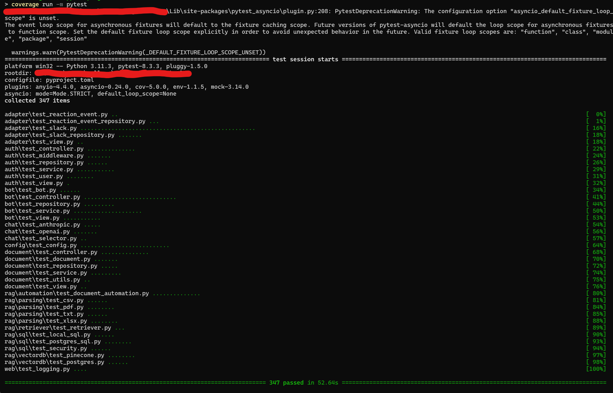

Any decently sized project will have tests setup to make sure that each change made to the software does not break anything. Ideally, these tests cover the majority, if not all functionalities that exist in the system. How do we measure coverage though? If you're a Python programmer, look no further than the `coverage` package!

<!-- truncate -->

## What is code coverage and why is it important?

You could write all manner of tests all you want but if it doesn't cover the meaningful parts of your program, then it's as good as useless. The goal of writing tests is to verify the behavior and correctness of a system based on a set of requirements. So it makes sense for us to want to cover most parts of our program: we want and should be able to verify the correctness of our system as much as possible. Code coverage is a measurement of this goal. It serves to measure just how much of our code is covered with the tests that we've written.

Knowing our code coverage has multiple advantages. Firstly, it allows us to know which parts have been tested and which ones haven't. This is important because we should put more emphasis on testing the critical parts of the code compared to the rest. Code coverage allows us to know if we've accomplished that or not. Another benefit is that we can map and identify old and legacy parts of the program that have been working well so far but aren't tested yet. This can be important as it's not uncommon for old parts of program that are left untouched to show nasty bugs later down the line. Code coverage also allows us to ensure the security and quality of our program by mapping the untested paths in our code which may hide vulnerabilities that aren't yet known.

Now that we know what and why code coverage is important, let's take a look at how we can measure them

## Measuring code coverage in Python

Any decently good programming language should have a way to measure code coverage. Since my team's project used Python, I'll cover a coverage tool that we used in our project. The tool is called--and you won't believe me when I say it--`coverage`.

<center>

.jpg)

</center>

### What is the `coverage` package?

It's a tool that we can use to measure the code coverage of Python programs. `coverage` supports different test runners such as `pytest`, `unittest`, and `nosetest`. Personally, I use `pytest` in my projects so I usually use `coverage` alongside `pytest`. 

### Getting started

Just like most Python packages, the `coverage` package is available in PyPI and can be installed with `pip`.

```bash
pip install coverage
```

To start measuring the coverage, you can call the `coverage` CLI using the test runner you used. Here's an example of it but with `pytest`:

```bash
coverage run -m pytest
```

<center>



_An example of running `coverage` in my project_

</center>

Ignoring the code for a moment, you'll notice that this is just the output of running `pytest`. This is because `coverage` saves the result into a file instead of outputting it directly into standard output. We can see the report by running `coverage report`

```bash
Name                                             Stmts   Miss  Cover
--------------------------------------------------------------------
adapter\__init__.py                                  0      0   100%
adapter\reaction_event.py                           25      0   100%
adapter\reaction_event_repository.py                42      0   100%
adapter\slack.py                                   281      0   100%
adapter\slack_dto.py                                10      0   100%
adapter\slack_repository.py                         64      0   100%
adapter\test_reaction_event.py                      31      0   100%
adapter\test_reaction_event_repository.py           53      0   100%
adapter\test_slack.py                              710      0   100%
adapter\test_slack_repository.py                    79      0   100%
adapter\test_view.py                                50      0   100%
adapter\view.py                                     25      0   100%
auth\__init__.py                                     4      0   100%
auth\conftest.py                                    75      1    99%
auth\controller.py                                  69      7    90%
auth\dto.py                                         11      0   100%
auth\exceptions.py                                  28      0   100%
auth\middleware.py                                  62      0   100%
auth\repository.py                                  62      5    92%
auth\service.py                                     85      6    93%
auth\test_controller.py                            112      0   100%
auth\test_middleware.py                             30      0   100%
auth\test_repository.py                             54      0   100%
auth\test_service.py                                94      0   100%
auth\test_user.py                                   36      0   100%
auth\test_view.py                                   22      0   100%
auth\user.py                                        35      0   100%
auth\utils.py                                        5      5     0%
auth\view.py                                        21      1    95%
bot\__init__.py                                      4      0   100%
bot\bot.py                                          70      0   100%
bot\conftest.py                                     55      1    98%
bot\controller.py                                   72      1    99%
bot\helper.py                                       12      0   100%
bot\repository.py                                   79      1    99%
bot\service.py                                      44      0   100%
bot\test_bot.py                                     28      0   100%
bot\test_controller.py                             197      0   100%
bot\test_repository.py                              84      0   100%
bot\test_service.py                                123      0   100%
bot\test_view.py                                   157     13    92%
bot\view.py                                         43      0   100%
chat\__init__.py                                    17      0   100%
chat\anthropic_chat.py                              12      0   100%
chat\engine.py                                      31      0   100%
chat\exceptions.py                                   4      0   100%
chat\openai_chat.py                                  8      0   100%
chat\test_anthropic.py                              55      0   100%
chat\test_openai.py                                 71      0   100%
chat\test_selector.py                               31      0   100%
common\shared_types.py                               3      0   100%
components\__init__.py                               0      0   100%
config\__init__.py                                 155      1    99%
config\test_config.py                              173      0   100%
db\__init__.py                                       5      5     0%
document\__init__.py                                 6      0   100%
document\conftest.py                                56      0   100%
document\controller.py                              79     15    81%
document\document.py                                45      0   100%
document\dto.py                                     36      1    97%
document\repository.py                              73      7    90%
document\service.py                                 60      5    92%
document\test_controller.py                         80      2    98%
document\test_document.py                           55      0   100%
document\test_repository.py                         60      6    90%
document\test_service.py                            55      0   100%
document\test_utils.py                              23      0   100%
document\test_view.py                               42      0   100%
document\utils.py                                    4      0   100%
document\view.py                                    30      1    97%
main.py                                            106    106     0%
rag\__init__.py                                      0      0   100%
rag\automation\__init__.py                           0      0   100%
rag\automation\document_automation.py               75      0   100%
rag\automation\test_document_automation.py         156      0   100%
rag\parsing\__init__.py                              0      0   100%
rag\parsing\parsing_csv.py                          30      0   100%
rag\parsing\parsing_pdf.py                          51      0   100%
rag\parsing\parsing_txt.py                          23      0   100%
rag\parsing\parsing_xlsx.py                         35      0   100%
rag\parsing\processor.py                            10      0   100%
rag\parsing\test_csv.py                             48      0   100%
rag\parsing\test_pdf.py                             85      4    95%
rag\parsing\test_txt.py                             50      0   100%
rag\parsing\test_xlsx.py                            59      0   100%
rag\retriever\__init__.py                            0      0   100%
rag\retriever\retriever.py                          18      0   100%
rag\retriever\test_retriever.py                     30      0   100%
rag\sql\__init__.py                                  0      0   100%
rag\sql\local\local_db_loader.py                    15      0   100%
rag\sql\local\local_query_engine.py                 43      0   100%
rag\sql\postgres_db_loader.py                       27      0   100%
rag\sql\postgres_query_engine.py                    40      0   100%
rag\sql\security.py                                 24      0   100%
rag\sql\test_local_sql.py                           77      0   100%
rag\sql\test_postgres_sql.py                       112      0   100%
rag\sql\test_security.py                            48      0   100%
rag\vectordb\__init__.py                             0      0   100%
rag\vectordb\pinecone\pinecone_handler.py           22      0   100%
rag\vectordb\pinecone\pinecone_node_storage.py      19      0   100%
rag\vectordb\postgres_handler.py                    42      0   100%
rag\vectordb\postgres_node_storage.py               19      0   100%
rag\vectordb\test_pinecone.py                       71      0   100%
rag\vectordb\test_postgres.py                       82      0   100%
web\__init__.py                                      0      0   100%
web\logging.py                                      45      0   100%
web\test_logging.py                                 53      0   100%
--------------------------------------------------------------------
TOTAL                                             5927    194    97%
```

Right away we can see which files are covered and how much of it is covered with tests. This is good but ideally we want to know which parts of the file is not yet covered. We can just add the `-m` flag which is short for `--show-missing` in front of it like this: `coverage report -m`.


```bash
Name                                             Stmts   Miss  Cover   Missing
------------------------------------------------------------------------------
adapter\__init__.py                                  0      0   100%
adapter\reaction_event.py                           25      0   100%
adapter\reaction_event_repository.py                42      0   100%
adapter\slack.py                                   281      0   100%
adapter\slack_dto.py                                10      0   100%
adapter\slack_repository.py                         64      0   100%
adapter\test_reaction_event.py                      31      0   100%
adapter\test_reaction_event_repository.py           53      0   100%
adapter\test_slack.py                              710      0   100%
adapter\test_slack_repository.py                    79      0   100%
adapter\test_view.py                                50      0   100%
adapter\view.py                                     25      0   100%
auth\__init__.py                                     4      0   100%
auth\conftest.py                                    75      1    99%   108
auth\controller.py                                  69      7    90%   16, 20, 24, 28, 32, 45-46
auth\dto.py                                         11      0   100%
auth\exceptions.py                                  28      0   100%
auth\middleware.py                                  62      0   100%
auth\repository.py                                  62      5    92%   32, 37, 41, 45, 49
auth\service.py                                     85      6    93%   22, 26, 30, 34, 112-113
auth\test_controller.py                            112      0   100%
auth\test_middleware.py                             30      0   100%
auth\test_repository.py                             54      0   100%
auth\test_service.py                                94      0   100%
auth\test_user.py                                   36      0   100%
auth\test_view.py                                   22      0   100%
auth\user.py                                        35      0   100%
auth\utils.py                                        5      5     0%   1-8
auth\view.py                                        21      1    95%   15
bot\__init__.py                                      4      0   100%
bot\bot.py                                          70      0   100%
bot\conftest.py                                     55      1    98%   87
bot\controller.py                                   72      1    99%   77
bot\helper.py                                       12      0   100%
bot\repository.py                                   79      1    99%   42
bot\service.py                                      44      0   100%
bot\test_bot.py                                     28      0   100%
bot\test_controller.py                             197      0   100%
bot\test_repository.py                              84      0   100%
bot\test_service.py                                123      0   100%
bot\test_view.py                                   157     13    92%   17-38
bot\view.py                                         43      0   100%
chat\__init__.py                                    17      0   100%
chat\anthropic_chat.py                              12      0   100%
chat\engine.py                                      31      0   100%
chat\exceptions.py                                   4      0   100%
chat\openai_chat.py                                  8      0   100%
chat\test_anthropic.py                              55      0   100%
chat\test_openai.py                                 71      0   100%
chat\test_selector.py                               31      0   100%
common\shared_types.py                               3      0   100%
components\__init__.py                               0      0   100%
config\__init__.py                                 155      1    99%   97
config\test_config.py                              173      0   100%
db\__init__.py                                       5      5     0%   1-7
document\__init__.py                                 6      0   100%
document\conftest.py                                56      0   100%
document\controller.py                              79     15    81%   16, 20, 24, 28, 32, 36, 84, 86-88, 116-118, 121, 124
document\document.py                                45      0   100%
document\dto.py                                     36      1    97%   31
document\repository.py                              73      7    90%   27, 31, 35, 39, 66, 68, 72
document\service.py                                 60      5    92%   18, 22, 26, 30, 34
document\test_controller.py                         80      2    98%   52-53
document\test_document.py                           55      0   100%
document\test_repository.py                         60      6    90%   104-110
document\test_service.py                            55      0   100%
document\test_utils.py                              23      0   100%
document\test_view.py                               42      0   100%
document\utils.py                                    4      0   100%
document\view.py                                    30      1    97%   18
main.py                                            106    106     0%   1-377
rag\__init__.py                                      0      0   100%
rag\automation\__init__.py                           0      0   100%
rag\automation\document_automation.py               75      0   100%
rag\automation\test_document_automation.py         156      0   100%
rag\parsing\__init__.py                              0      0   100%
rag\parsing\parsing_csv.py                          30      0   100%
rag\parsing\parsing_pdf.py                          51      0   100%
rag\parsing\parsing_txt.py                          23      0   100%
rag\parsing\parsing_xlsx.py                         35      0   100%
rag\parsing\processor.py                            10      0   100%
rag\parsing\test_csv.py                             48      0   100%
rag\parsing\test_pdf.py                             85      4    95%   20-23
rag\parsing\test_txt.py                             50      0   100%
rag\parsing\test_xlsx.py                            59      0   100%
rag\retriever\__init__.py                            0      0   100%
rag\retriever\retriever.py                          18      0   100%
rag\retriever\test_retriever.py                     30      0   100%
rag\sql\__init__.py                                  0      0   100%
rag\sql\local\local_db_loader.py                    15      0   100%
rag\sql\local\local_query_engine.py                 43      0   100%
rag\sql\postgres_db_loader.py                       27      0   100%
rag\sql\postgres_query_engine.py                    40      0   100%
rag\sql\security.py                                 24      0   100%
rag\sql\test_local_sql.py                           77      0   100%
rag\sql\test_postgres_sql.py                       112      0   100%
rag\sql\test_security.py                            48      0   100%
rag\vectordb\__init__.py                             0      0   100%
rag\vectordb\pinecone\pinecone_handler.py           22      0   100%
rag\vectordb\pinecone\pinecone_node_storage.py      19      0   100%
rag\vectordb\postgres_handler.py                    42      0   100%
rag\vectordb\postgres_node_storage.py               19      0   100%
rag\vectordb\test_pinecone.py                       71      0   100%
rag\vectordb\test_postgres.py                       82      0   100%
web\__init__.py                                      0      0   100%
web\logging.py                                      45      0   100%
web\test_logging.py                                 53      0   100%
------------------------------------------------------------------------------
TOTAL                                             5927    194    97%
```

And there you have it. We can see which parts of the file is not yet handled and write the appropriate tests to cover them. That pretty much covers the basics of using `coverage`. But we can definitely do better than that.

### Improving our `coverage` setup

`coverage` is configurable in different ways such as using a `.coveragerc` file, inside a `pyproject.toml` file, or using `tox.ini` if the project uses tox. I will show how the project is setup using `pyproject.toml` as it's a pretty standard configuration file in most Python projects.

#### Excluding files from being checked for coverage

Sometimes, there are files/parts of your program that you want to exclude from coverage checks. Some reasons include:

1. It's a test file
2. It contains setup logic that doesn't need to be validated or tested
3. It's not worth the effort to cover it

In these cases, we can configure the `tool.coverage.run` directive in the `pyproject.toml` file. Here's an example

```toml
[tool.coverage.run]
source = ["."]
omit = ["db/__init__.py", "main.py"]
```

In this case, I want to exclude the database initialization logic as well as the main file of the program which is mostly dependency injection and starting up the server as it's not worth the effort in my project to attempt to handle it.

#### Excluding parts of a file from being checked

What if we wanted to exclude some parts of the program? For example, there's a function in my program which calls the Slack SDK's function to handle events. If something happens here, it's mostly a problem with the SDK which tests won't really help with. In this case, we can add several lines to check for in a file which tells `coverage` to exclude it. The directive we're looking for is the `tool.coverage.report` directive.

```toml
[tool.coverage.report]
exclude_lines = [
    # Exclude abstract methods
    "@abc.abstractmethod",
    "@abstractmethod",
    # Have to re-enable the standard pragma
    "pragma: no cover",
    # Don't complain about missing debug-only code
    "def __repr__",
    "if self.debug",
    # Don't complain if tests don't hit defensive assertion code
    "raise AssertionError",
    "raise NotImplementedError",
]
```

In this case, I want to exclude abstract classes and functions. I also want to exclude debug-only code as well as functions that are not implemented yet. The `pragma: no cover` line is used in places where I want to exclude such as in an if-else statement, before a function declaration, etc. Here's an example of me excluding the tracing portion of the code since it's not integral to the program itself:

```python
def some_function(self):
    transaction = sentry_sdk.get_current_scope().transaction
    if transaction is not None:  # pragma: no cover
        trace_id = transaction.trace_id
    else:
        trace_id = ""
```

This excludes the `if transaction is not None` branch from being checked. Here's how I excluded the function which uses the Slack SDK to handle events:

```python
# Function to listen for events on Slack. No need to test this since this is purely dependent on
# Bolt
async def handle_events(self, req: Request):  # pragma: no cover
    return await self.handler.handle(req)
```

#### Excluding test files

Ideally, we don't want to include our actual test files from coverage because that would be quite redundant and would incorrectly influence the actual coverage being measured. Since `pytest` runs checks for Python files prefixed by `test_` in the name, we can exclude it when reading the report like this `coverage report -m --omit="*/test_*.py"`

```bash
Name                                             Stmts   Miss  Cover   Missing
------------------------------------------------------------------------------
adapter\__init__.py                                  0      0   100%
adapter\reaction_event.py                           25      0   100%
adapter\reaction_event_repository.py                42      0   100%
adapter\slack.py                                   281      0   100%
adapter\slack_dto.py                                10      0   100%
adapter\slack_repository.py                         64      0   100%
adapter\view.py                                     25      0   100%
auth\__init__.py                                     4      0   100%
auth\conftest.py                                    75      1    99%   108
auth\controller.py                                  69      7    90%   16, 20, 24, 28, 32, 45-46
auth\dto.py                                         11      0   100%
auth\exceptions.py                                  28      0   100%
auth\middleware.py                                  62      0   100%
auth\repository.py                                  62      5    92%   32, 37, 41, 45, 49
auth\service.py                                     85      6    93%   22, 26, 30, 34, 112-113
auth\user.py                                        35      0   100%
auth\utils.py                                        5      5     0%   1-8
auth\view.py                                        21      1    95%   15
bot\__init__.py                                      4      0   100%
bot\bot.py                                          70      0   100%
bot\conftest.py                                     55      1    98%   87
bot\controller.py                                   72      1    99%   77
bot\helper.py                                       12      0   100%
bot\repository.py                                   79      1    99%   42
bot\service.py                                      44      0   100%
bot\view.py                                         43      0   100%
chat\__init__.py                                    17      0   100%
chat\anthropic_chat.py                              12      0   100%
chat\engine.py                                      31      0   100%
chat\exceptions.py                                   4      0   100%
chat\openai_chat.py                                  8      0   100%
common\shared_types.py                               3      0   100%
components\__init__.py                               0      0   100%
config\__init__.py                                 155      1    99%   97
db\__init__.py                                       5      5     0%   1-7
document\__init__.py                                 6      0   100%
document\conftest.py                                56      0   100%
document\controller.py                              79     15    81%   16, 20, 24, 28, 32, 36, 84, 86-88, 116-118, 121, 124
document\document.py                                45      0   100%
document\dto.py                                     36      1    97%   31
document\repository.py                              73      7    90%   27, 31, 35, 39, 66, 68, 72
document\service.py                                 60      5    92%   18, 22, 26, 30, 34
document\utils.py                                    4      0   100%
document\view.py                                    30      1    97%   18
main.py                                            106    106     0%   1-377
rag\__init__.py                                      0      0   100%
rag\automation\__init__.py                           0      0   100%
rag\automation\document_automation.py               75      0   100%
rag\parsing\__init__.py                              0      0   100%
rag\parsing\parsing_csv.py                          30      0   100%
rag\parsing\parsing_pdf.py                          51      0   100%
rag\parsing\parsing_txt.py                          23      0   100%
rag\parsing\parsing_xlsx.py                         35      0   100%
rag\parsing\processor.py                            10      0   100%
rag\retriever\__init__.py                            0      0   100%
rag\retriever\retriever.py                          18      0   100%
rag\sql\__init__.py                                  0      0   100%
rag\sql\local\local_db_loader.py                    15      0   100%
rag\sql\local\local_query_engine.py                 43      0   100%
rag\sql\postgres_db_loader.py                       27      0   100%
rag\sql\postgres_query_engine.py                    40      0   100%
rag\sql\security.py                                 24      0   100%
rag\vectordb\__init__.py                             0      0   100%
rag\vectordb\pinecone\pinecone_handler.py           22      0   100%
rag\vectordb\pinecone\pinecone_node_storage.py      19      0   100%
rag\vectordb\postgres_handler.py                    42      0   100%
rag\vectordb\postgres_node_storage.py               19      0   100%
web\__init__.py                                      0      0   100%
web\logging.py                                      45      0   100%
------------------------------------------------------------------------------
TOTAL                                             2551    169    93%
```

Alternatively, you can specify the `omit` field in the `tool.coverage.report` directive of `pyproject.toml` as well.

```toml
[tool.coverage.report]
omit = ["*/test_*.py"]
```

There are other fields that we can configure and you can read more all about it in the [configuration reference](https://coverage.readthedocs.io/en/7.6.9/config.html) for `coverage`. Now that we know how to get a pretty good setup to measure code coverage in our Python project, I'll be covering in another post on how to use the `coverage` report and pipe it into a static analysis and code quality tool like SonarCloud on your CI pipelines. Until next time!

## References

- [Why is code coverage so important?](https://www.qt.io/blog/quality-assurance/why-is-code-coverage-so-important)
- [Coverage.py -- Coverage.py 7.6.9 documentation](https://coverage.readthedocs.io/en/7.6.9/)
- [Configuration reference -- Coverage.py 7.6.9 documentation](https://coverage.readthedocs.io/en/7.6.9/config.html)
- [Command line usage -- Coverage.py 7.6.9 documentation](https://coverage.readthedocs.io/en/7.6.9/cmd.html)